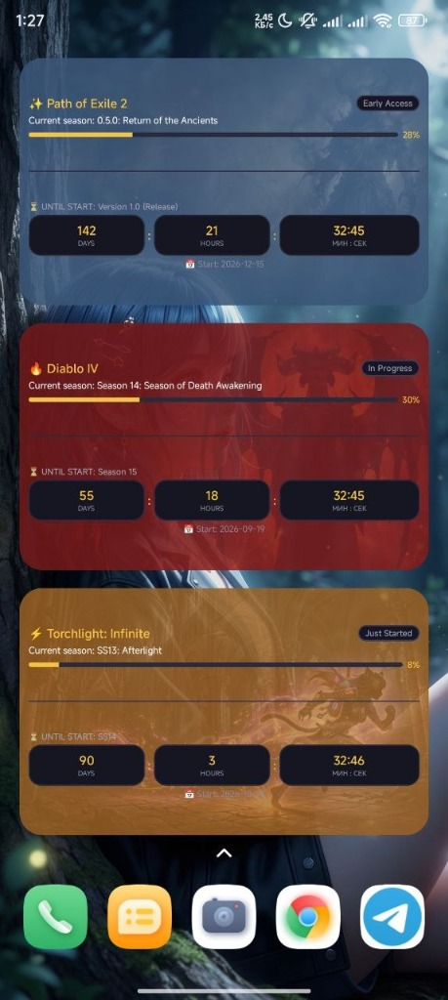
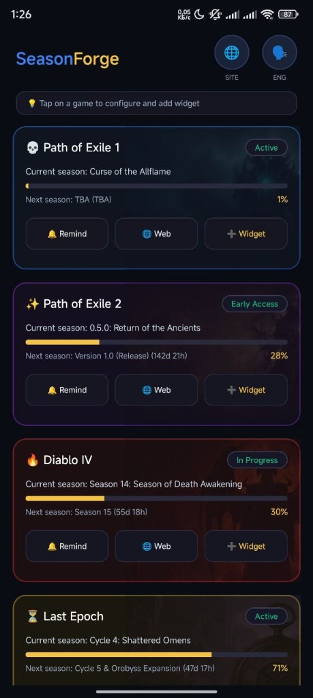
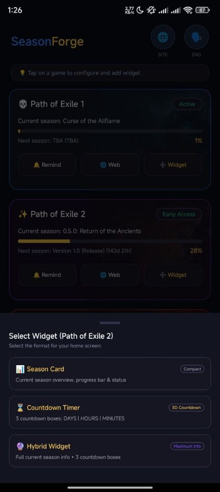
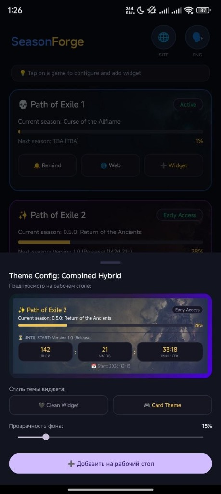
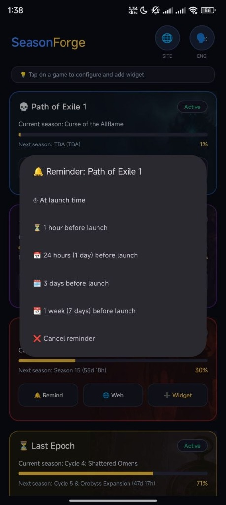

# SeasonForge Mobile

[](https://github.com/SeasonForge/SeasonForgeMobile/releases/latest)
[](https://developer.android.com/)
[](#license)

Language: **English** | [Русский](README.ru.md)

Android mobile application and desktop home screen widgets for tracking season and league start dates in ARPG games (Path of Exile 1 & 2, Diablo IV, Last Epoch, Torchlight: Infinite, etc.).

[Download Latest Version (APK)](https://github.com/SeasonForge/SeasonForgeMobile/releases/latest)

---

## Screenshots

<p align="center">
  
  
  
</p>

<p align="center">
  
  
</p>

---

## Features

* **Live Home Screen Widgets**: 3 customizable widget types with real-time countdown. Powered by native `Chronometer` with zero background battery drain.
* **ARPG & MMO Game Tracking**: Support for Path of Exile 1 & 2, Diablo IV, Last Epoch, Torchlight: Infinite, and more.
* **Notifications & Reminders**: Configurable alerts for 1 week, 3 days, 24 hours, 1 hour before launch, or right at start time.
* **Appearance Customization**: Adjustable background transparency, theme colors, and game card art.
* **Bilingual Interface**: Full localization support for English and Russian.

---

## Installation & Google Play Protect Notice

When installing the application directly via an APK file from GitHub, the Android OS or Google Play Protect may display an "Unrecognized Developer" or "Unknown Source" warning.

### Installation Steps:
1. Open the downloaded APK file.
2. When the security prompt appears, tap **"More details"**.
3. Tap **"Install anyway"**.

---

## Tech Stack & Architecture

* **Language**: Kotlin
* **UI**: Android Jetpack / Material Design 3 / RemoteViews
* **Concurrency**: Kotlin Coroutines & Flow
* **Networking**: OkHttp / Gson
* **Architecture**: Clean Architecture (MVVM)

---

## Build & Setup

### Requirements:
* Android Studio Ladybug or newer
* JDK 17
* Android SDK 26+ (Android 8.0+)

### Building from Source:
1. Clone the repository:
   ```bash
   git clone https://github.com/SeasonForge/SeasonForgeMobile.git
   ```
2. Open the project in Android Studio.
3. Build Debug APK:
   ```bash
   ./gradlew assembleDebug
   ```

---

## License

© 2026 SeasonForge. All rights reserved.
